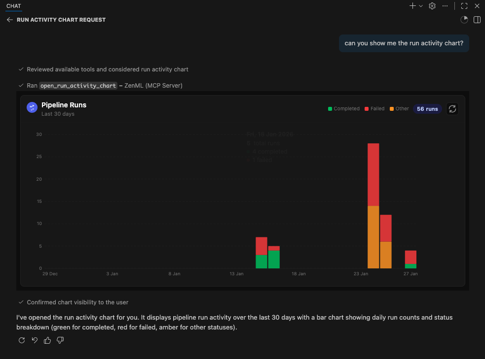
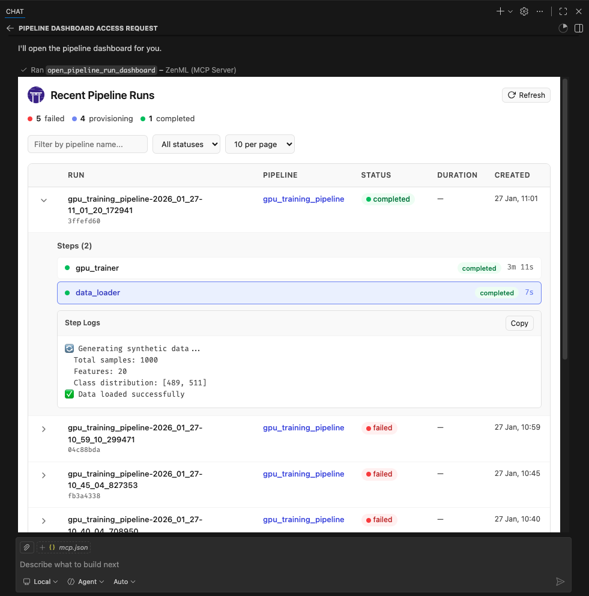

# MCP Server for ZenML
[](https://archestra.ai/mcp-catalog/zenml-io__mcp-zenml)

This project implements a [Model Context Protocol
(MCP)](https://modelcontextprotocol.io/introduction) server for interacting with
the [ZenML](https://zenml.io) API.


## What is MCP?

The Model Context Protocol (MCP) is an open protocol that standardizes how
applications provide context to Large Language Models (LLMs). It acts like a
"USB-C port for AI applications" - providing a standardized way to connect AI
models to different data sources and tools.

MCP follows a client-server architecture where:
- **MCP Hosts**: Programs like Claude Desktop or IDEs that want to access data through MCP
- **MCP Clients**: Protocol clients that maintain 1:1 connections with servers
- **MCP Servers**: Lightweight programs that expose specific capabilities through the standardized protocol
- **Local Data Sources**: Your computer's files, databases, and services that MCP servers can securely access
- **Remote Services**: External systems available over the internet that MCP servers can connect to

## What is ZenML?

ZenML is an open-source platform for building and managing ML and AI pipelines.
It provides a unified interface for managing data, models, and experiments.

For more information, see the [ZenML website](https://zenml.io) and [our documentation](https://docs.zenml.io).

## Features

The server provides MCP tools to access core read functionality from the ZenML
server, providing a way to get live information about:

### Core Entities
- **Users** - user accounts and permissions
- **Stacks** - infrastructure configurations
- **Stack Components** - individual stack building blocks
- **Flavors** - available component types
- **Service Connectors** - cloud authentication

### Pipeline Execution
- **Pipelines** - pipeline definitions
- **Pipeline Runs** - execution history and status
- **Pipeline Steps** - individual step details, code, and logs
- **Schedules** - automated run schedules
- **Artifacts** - metadata about data artifacts (not the data itself)

### Deployment & Serving
- **Snapshots** - frozen pipeline configurations (the "what to run/serve" artifact)
- **Deployments** - runtime serving instances with status, URL, and logs
- **Services** - model serving endpoints

### Organization & Discovery
- **Projects** - organizational containers for ZenML resources
- **Tags** - cross-cutting metadata labels for discovery
- **Builds** - pipeline build artifacts with image and code info

### Models
- **Models** - ML model registry entries
- **Model Versions** - versioned model artifacts

### Deprecated (migration recommended)
- ~~Pipeline run templates~~ → use **Snapshots** instead (see [Migration Guide](#migration-run-templates--snapshots))

The server also allows you to **trigger new pipeline runs** using snapshots (preferred) or run templates (deprecated).

*Note: We're continuously improving this integration based on user feedback.
Please join our [Slack community](https://zenml.io/slack) to share your experience
and help us make it even better!*

## Available Tools

The MCP server exposes the following tools, grouped by category:

### Pipeline Execution (New in v1.2)
| Tool | Description |
|------|-------------|
| `get_snapshot` | Get a frozen pipeline configuration by name/ID |
| `list_snapshots` | List snapshots with filters (runnable, deployable, deployed, tag) |
| `get_deployment` | Get a deployment's runtime status and URL |
| `list_deployments` | List deployments with filters (status, pipeline, tag) |
| `get_deployment_logs` | Get bounded logs from a deployment (tail=100 default, max 1000) |
| `trigger_pipeline` | Trigger a pipeline run (prefer `snapshot_name_or_id` parameter) |

### Organization (New in v1.2)
| Tool | Description |
|------|-------------|
| `get_active_project` | Get the currently active project |
| `get_project` | Get project details by name/ID |
| `list_projects` | List all projects |
| `get_tag` | Get tag details (exclusive, colors) |
| `list_tags` | List tags with filters (resource_type) |
| `get_build` | Get build details (image, code embedding) |
| `list_builds` | List builds with filters (is_local, contains_code) |

### Core Entities
| Tool | Description |
|------|-------------|
| `get_user`, `list_users`, `get_active_user` | User management |
| `get_stack`, `list_stacks` | Stack configurations |
| `get_stack_component`, `list_stack_components` | Stack components |
| `get_flavor`, `list_flavors` | Component flavors |
| `get_service_connector`, `list_service_connectors` | Cloud connectors |
| `get_pipeline_run`, `list_pipeline_runs` | Pipeline runs |
| `get_run_step`, `list_run_steps` | Step details |
| `get_step_logs`, `get_step_code` | Step logs and source code |
| `list_pipelines`, `get_pipeline_details` | Pipeline definitions |
| `get_schedule`, `list_schedules` | Schedules |
| `list_artifacts` | Artifact metadata |
| `list_secrets` | Secret names (not values) |
| `get_service`, `list_services` | Model services |
| `get_model`, `list_models` | Model registry |
| `get_model_version`, `list_model_versions` | Model versions |

### Interactive Apps (Experimental)
| Tool | Description |
|------|-------------|
| `open_pipeline_run_dashboard` | Open interactive pipeline runs dashboard (MCP App) |
| `open_run_activity_chart` | Open 30-day run activity bar chart (MCP App) |

### Analysis Tools
| Tool | Description |
|------|-------------|
| `stack_components_analysis` | Analyze stack component usage |
| `recent_runs_analysis` | Analyze recent pipeline runs |
| `most_recent_runs` | Get N most recent runs |

### Deprecated Tools
| Tool | Replacement |
|------|-------------|
| `get_run_template` | Use `get_snapshot` instead |
| `list_run_templates` | Use `list_snapshots` instead |
| `trigger_pipeline(template_id=...)` | Use `trigger_pipeline(snapshot_name_or_id=...)` |

## Migration: Run Templates → Snapshots

**Why the change?** ZenML evolved its "runnable pipeline artifact" concept. Run Templates are now deprecated wrappers that internally just point to Snapshots. New code should use Snapshots directly.

### Quick Migration Guide

| Old Pattern (Templates) | New Pattern (Snapshots) |
|------------------------|------------------------|
| `list_run_templates()` | `list_snapshots(runnable=True, named_only=True)` |
| `get_run_template(name)` | `get_snapshot(name, include_config_schema=True)` |
| `trigger_pipeline(template_id=...)` | `trigger_pipeline(snapshot_name_or_id=...)` |

### Example Workflow (Snapshot-First)

```
1. Discover project context:
   → get_active_project()

2. Find runnable snapshots:
   → list_snapshots(runnable=True, named_only=True)

3. Trigger a run:
   → trigger_pipeline(pipeline_name_or_id="my-pipeline", snapshot_name_or_id="my-snapshot")

4. Check deployments:
   → list_deployments(status="running")
   → get_deployment_logs(name_id_or_prefix="my-deployment", tail=100)
```

**Note:** `get_deployment_logs` returns bounded output (default 100 lines, max 1000, capped at 100KB) and requires the appropriate deployer integration to be installed.

## Quick Setup via Dashboard (Recommended)

The easiest way to set up the ZenML MCP Server is through your ZenML dashboard's **MCP Settings page**.


Navigate to **Settings → MCP** in your ZenML dashboard to get:

- **Pre-configured snippets** for your specific server URL and credentials
- **One-click installation** via deep links for supported IDEs
- **Copy-paste configurations** for VS Code, Claude Desktop, Cursor, Claude Code, OpenAI Codex, and more
- **Docker and uv options** based on your preference

### ZenML Pro Users

The MCP Settings page lets you generate a Personal Access Token (PAT) with a single click. The token is automatically included in all generated configuration snippets.

### ZenML OSS Users

1. First create a service account token via **Settings → Service Accounts**
2. Paste the token into the MCP Settings page
3. Copy the generated configuration for your IDE

---

**Prefer manual setup?** See the detailed instructions below.

## MCP Apps (Experimental)

> **What are MCP Apps?** MCP Apps are interactive HTML UIs that MCP servers can
> serve directly into AI clients. They render in sandboxed iframes and can call
> server tools bidirectionally. See the [official announcement](https://blog.modelcontextprotocol.io/posts/2026-01-26-mcp-apps/)
> for full details.



This server includes two experimental MCP Apps:

| App | Tool | Description |
|-----|------|-------------|
| **Pipeline Runs Dashboard** | `open_pipeline_run_dashboard` | Interactive table of recent pipeline runs with status, step details, and logs |
| **Run Activity Chart** | `open_run_activity_chart` | Bar chart of pipeline run activity over the last 30 days with status breakdown |



These apps are included as proof-of-concept examples. We welcome feedback and contributions for more MCP Apps. It is still early days for this new feature so we'll have to see how it evolves. We expect to support it more fully in the future.

### Supported Clients

MCP Apps require **Streamable HTTP** transport (not stdio). The following clients
currently support MCP Apps:

- ✅ **VS Code** (Insiders Edition)
- ✅ **Goose**
- ✅ **ChatGPT** (launching soon)
- ⚠️ **Claude Desktop** -- as of late January 2026, doesn't yet render Apps.
- ⚠️ **Claude.ai** (web) — as of late January 2026, doesn't yet render Apps.

> **Note:** We were unable to test thoroughly with Claude Desktop or Claude.ai at the time of writing. If you encounter issues, please [report them](https://github.com/zenml-io/mcp-zenml/issues).

### Running MCP Apps with Docker

MCP Apps require Streamable HTTP transport and a publicly reachable URL (for
cloud-hosted clients like Claude.ai). The simplest setup uses Docker +
Cloudflare tunnel:

**1. Build and run the Docker container:**

```bash
docker build -t mcp-zenml:apps .

docker run --rm -d --name mcp-zenml-apps -p 8001:8001 \
  -e ZENML_STORE_URL="https://your-zenml-server.example.com" \
  -e ZENML_STORE_API_KEY="your-api-key" \
  -e ZENML_ACTIVE_PROJECT_ID="your-project-id" \
  mcp-zenml:apps --transport streamable-http --host 0.0.0.0 --port 8001 \
  --disable-dns-rebinding-protection
```

**2. Start a Cloudflare tunnel (for cloud clients):**

```bash
npx cloudflared tunnel --url http://localhost:8001
```

This prints a public URL like `https://random-words.trycloudflare.com`.

**3. Connect your client:**

- In Claude Desktop or other clients, add the MCP server with URL:
  `https://random-words.trycloudflare.com/mcp` e.g.:

```json
{
	"servers": {
		"ZenML": {
			"url": "https://USE-YOUR-OWN-URL.trycloudflare.com/mcp",
			"type": "http"
		}
	},
	"inputs": []
}
```

- Ask the AI to "open the pipeline runs dashboard" or "show the run activity chart"

**Important notes:**
- `ZENML_ACTIVE_PROJECT_ID` is required — without it, pipeline run tools will
  fail with "No project is currently set as active"
- The `--disable-dns-rebinding-protection` flag is needed when running behind
  reverse proxies (cloudflared, ngrok) — it's safe when the proxy handles security
- The tunnel URL changes on each restart — update your client integration accordingly

## Testing & Quality Assurance

This project includes automated testing to ensure the MCP server remains functional:

- **🔄 Automated Smoke Tests**: A comprehensive smoke test runs every 3 days via GitHub Actions
- **🚨 Issue Creation**: Failed tests automatically create GitHub issues with detailed debugging information
- **⚡ Fast CI**: Uses UV with caching for quick dependency installation and testing
- **🧪 Manual Testing**: You can run the smoke test locally using `uv run scripts/test_mcp_server.py server/zenml_server.py`

The automated tests verify:
- MCP protocol connection and handshake
- Server initialization and tool discovery
- Basic tool functionality (when ZenML server is accessible)
- Resource and prompt enumeration

## Debugging with MCP Inspector

For interactive debugging, use the [MCP Inspector](https://modelcontextprotocol.io/docs/tools/inspector) — a web-based tool that lets you test MCP tools in real-time:

```bash
# Using .env.local (recommended for development)
cp .env.local.example .env.local  # Then edit with your credentials
source .env.local && npx @modelcontextprotocol/inspector \
  -e ZENML_STORE_URL=$ZENML_STORE_URL \
  -e ZENML_STORE_API_KEY=$ZENML_STORE_API_KEY \
  -- uv run server/zenml_server.py
```

This opens a web UI with your credentials pre-filled — just click **Connect** and use the **Tools** tab to test any tool interactively.

See [CLAUDE.md](CLAUDE.md#debugging-with-mcp-inspector) for more detailed debugging instructions.

## Privacy & Analytics

The ZenML MCP Server collects anonymous usage analytics to help us improve the product.

**We track:**
- Which tools are used and how often
- Error rates and types (error type only, no messages)
- Basic environment info (OS, Python version, and whether running in Docker/CI)
- Session duration and tool usage patterns

**We do NOT collect:**
- Your ZenML server URL or API key
- Pipeline names, model names, or any business data
- Error messages or stack traces
- Any personally identifiable information

**To disable analytics:**

```bash
# Option 1
export ZENML_MCP_ANALYTICS_ENABLED=false

# Option 2
export ZENML_MCP_DISABLE_ANALYTICS=true
```

**For debugging/testing (logs events to stderr instead of sending):**

```bash
export ZENML_MCP_ANALYTICS_DEV=true
```

**For Docker users:** Set `ZENML_MCP_ANALYTICS_ID` to maintain a consistent anonymous ID across container restarts.

## Manual Setup

### Prerequisites

You will need to have access to a deployed ZenML server. If you don't have one,
you can sign up for a free trial at [ZenML Pro](https://cloud.zenml.io) and we'll manage the deployment for you.

> **Tip:** Once you have a ZenML server, check out the [MCP Settings page](#quick-setup-via-dashboard-recommended) in your dashboard for the easiest setup experience.

> **Compatibility:** This MCP server is tested with and recommended for **ZenML >= 0.93.0**.
> If you are running an older ZenML version, please use an [earlier release](https://github.com/zenml-io/mcp-zenml/releases) of this MCP server.

You will also (probably) need to have `uv` installed locally. For more information, see
the [`uv` documentation](https://docs.astral.sh/uv/getting-started/installation/).
We recommend installation via their installer script or via `brew` if using a
Mac. (Technically you don't *need* it, but it makes installation and setup easy.)

You will also need to clone this repository somewhere locally:

```bash
git clone https://github.com/zenml-io/mcp-zenml.git
```

### Your MCP config file

The MCP config file is a JSON file that tells the MCP client how to connect to
your MCP server. Different MCP clients will use or specify this differently. Two
commonly-used MCP clients are [Claude Desktop](https://claude.ai/download) and
[Cursor](https://www.cursor.com/), for which we provide installation instructions
below.

You will need to specify your ZenML MCP server in the following format:

```json
{
    "mcpServers": {
        "zenml": {
            "command": "/usr/local/bin/uv",
            "args": ["run", "path/to/server/zenml_server.py"],
            "env": {
                "LOGLEVEL": "WARNING",
                "NO_COLOR": "1",
                "ZENML_LOGGING_COLORS_DISABLED": "true",
                "ZENML_LOGGING_VERBOSITY": "WARN",
                "ZENML_ENABLE_RICH_TRACEBACK": "false",
                "PYTHONUNBUFFERED": "1",
                "PYTHONIOENCODING": "UTF-8",
                "ZENML_STORE_URL": "https://your-zenml-server-goes-here.com",
                "ZENML_STORE_API_KEY": "your-api-key-here"
            }
        }
    }
}
```

There are four dummy values that you will need to replace:

- the path to your locally installed `uv` (the path listed above is where it
  would be on a Mac if you installed it via `brew`)
- the path to the `zenml_server.py` file (this is the file that will be run when
  you connect to the MCP server). This file is located inside this repository at
  the root. You will need to specify the exact full path to this file.
- the ZenML server URL (this is the URL of your ZenML server. You can find this
  in the ZenML Cloud UI). It will look something like `https://d534d987a-zenml.cloudinfra.zenml.io`.
- the ZenML server API key (this is the API key for your ZenML server. You can
  find this in the ZenML Cloud UI or [read these
  docs](https://docs.zenml.io/how-to/manage-zenml-server/connecting-to-zenml/connect-with-a-service-account)
  on how to create one. For the purposes of the ZenML MCP server we recommend
  using a service account.)

You are free to change the way you run the MCP server Python file, but using
`uv` will probably be the easiest option since it handles the environment and
dependency installation for you.


### Installation for use with Claude Desktop

> **Quick alternative:** Use the MCP Settings page in your ZenML dashboard (Settings → MCP) to get pre-configured installation instructions and deep links for Claude Desktop.

You will need to have the latest version of [Claude Desktop](https://claude.ai/download) installed.

You can simply open the Settings menu and drag the `mcp-zenml.mcpb` file from the
root of this repository onto the menu and it will guide you through the
installation and setup process. You'll need to add your ZenML server URL and API key.

Note: MCP bundles (`.mcpb`) replace the older Desktop Extensions (`.dxt`) format; existing `.dxt` files still work in Claude Desktop.

#### Optional: Improving ZenML Tool Output Display

For a better experience with ZenML tool results, you can configure Claude to
display the JSON responses in a more readable format. In Claude Desktop, go to
Settings → Profile, and in the "What personal preferences should Claude consider
in responses?" section, add something like the following (or use these exact
words!):

```markdown
When using zenml tools which return JSON strings and you're asked a question, you might want to consider using markdown tables to summarize the results or make them easier to view!
```

This will encourage Claude to format ZenML tool outputs as markdown tables,
making the information much easier to read and understand.

### Installation for use with Cursor

> **Quick alternative:** The MCP Settings page in your ZenML dashboard (Settings → MCP) can generate the exact `mcp.json` content with your credentials pre-filled.

You will need to have [Cursor](https://www.cursor.com/) installed.

Cursor works slightly differently to Claude Desktop in that you specify the
config file on a per-repository basis. This means that if you want to use the
ZenML MCP server in multiple repos, you will need to specify the config file in
each of them.

To set it up for a single repository, you will need to:

- create a `.cursor` folder in the root of your repository
- inside it, create a `mcp.json` file with the content above
- go into your Cursor settings and click on the ZenML server to 'enable' it.

In our experience, sometimes it shows a red error indicator even though it is
working. You can try it out by chatting in the Cursor chat window. It will let
you know if is able to access the ZenML tools or not.

## Docker Image

You can run the server as a Docker container. The process communicates over stdio, so it will wait for an MCP client connection. Pass your ZenML credentials via environment variables.

### Prebuilt Images (Docker Hub)

Pull the latest multi-arch image:

```bash
docker pull zenmldocker/mcp-zenml:latest
```

Versioned releases are tagged as `X.Y.Z`:

```bash
docker pull zenmldocker/mcp-zenml:1.0.8
```

Run with your ZenML credentials (stdio mode):

```bash
docker run -i --rm \
  -e ZENML_STORE_URL="https://your-zenml-server.example.com" \
  -e ZENML_STORE_API_KEY="your-api-key" \
  zenmldocker/mcp-zenml:latest
```

### Canonical MCP config using Docker

```json
{
  "mcpServers": {
    "zenml": {
      "command": "docker",
      "args": [
        "run", "-i", "--rm",
        "-e", "ZENML_STORE_URL=https://...",
        "-e", "ZENML_STORE_API_KEY=ZENKEY_...",
        "-e", "ZENML_ACTIVE_PROJECT_ID=...",
        "-e", "LOGLEVEL=WARNING",
        "-e", "NO_COLOR=1",
        "-e", "ZENML_LOGGING_COLORS_DISABLED=true",
        "-e", "ZENML_LOGGING_VERBOSITY=WARN",
        "-e", "ZENML_ENABLE_RICH_TRACEBACK=false",
        "-e", "PYTHONUNBUFFERED=1",
        "-e", "PYTHONIOENCODING=UTF-8",
        "zenmldocker/mcp-zenml:latest"
      ]
    }
  }
}
```

### Build Locally

From the repository root:

```bash
docker build -t zenmldocker/mcp-zenml:local .
```

Run the locally built image:

```bash
docker run -i --rm \
  -e ZENML_STORE_URL="https://your-zenml-server.example.com" \
  -e ZENML_STORE_API_KEY="your-api-key" \
  zenmldocker/mcp-zenml:local
```

## MCP Bundles (.mcpb)

This project uses MCP Bundles (`.mcpb`) — the successor to Anthropic's Desktop Extensions (DXT). MCP Bundles package an entire MCP server (including dependencies) into a single file with user-friendly configuration.

Note on rename: MCP Bundles replace the older `.dxt` format. Claude Desktop remains backward‑compatible with existing `.dxt` files, but we now ship `mcp-zenml.mcpb` and recommend using it going forward.

The `mcp-zenml.mcpb` file in the repository root contains everything needed to run the ZenML MCP server, eliminating the need for complex manual installation steps. This makes powerful ZenML integrations accessible to users without requiring technical setup expertise.

When you drag and drop the `.mcpb` file into Claude Desktop's settings, it automatically handles:
- Runtime dependency installation
- Secure configuration management  
- Cross-platform compatibility
- User-friendly setup process

For more information, see Anthropic's announcement of Desktop Extensions (DXT) and related MCP bundle packaging guidance in their documentation: https://www.anthropic.com/engineering/desktop-extensions

## Published on the Anthropic MCP Registry

This MCP server is published to the official Anthropic MCP Registry and is discoverable by compatible hosts. On each **tagged release**, our CI updates the registry entry via the registry’s `mcp-publisher` CLI using GitHub OIDC, so you can install or discover the **ZenML MCP Server** directly wherever the registry is supported (e.g., Claude Desktop’s Extensions catalog).

- **Always up to date:** the registry entry is refreshed with every release from the tagged commit’s `manifest.json` and `server.json`.
- **Alternate install paths:** you can still install locally via the packaged `.mcpb` bundle (see above) or run the Docker image.

Learn more about the registry here:
- Anthropic MCP Registry (community repo): https://github.com/modelcontextprotocol/registry
