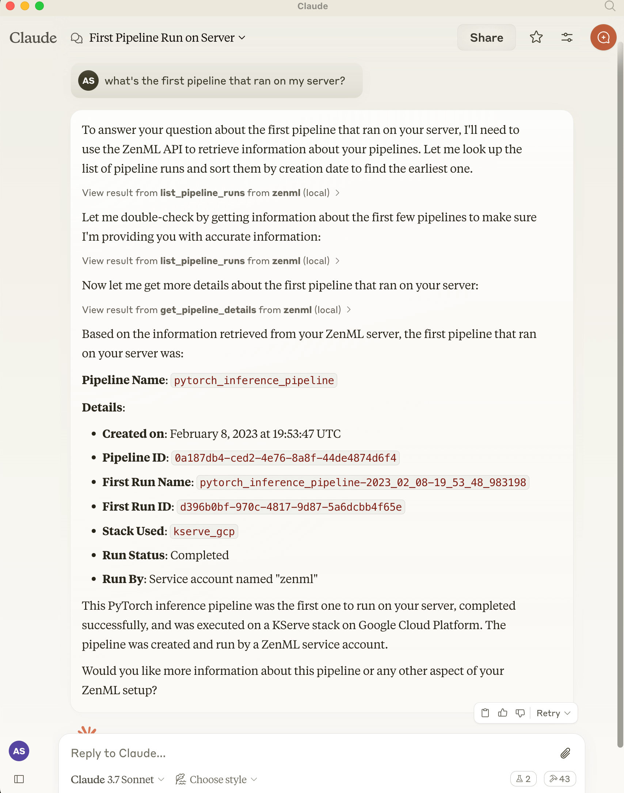
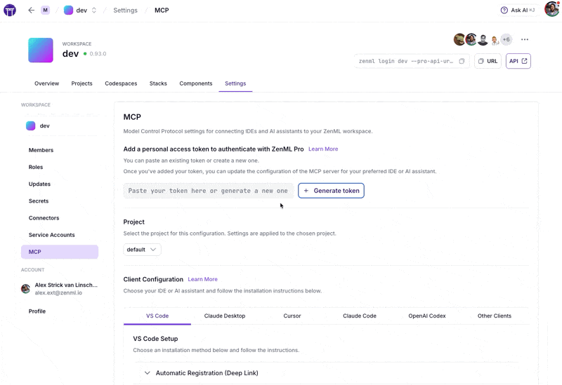
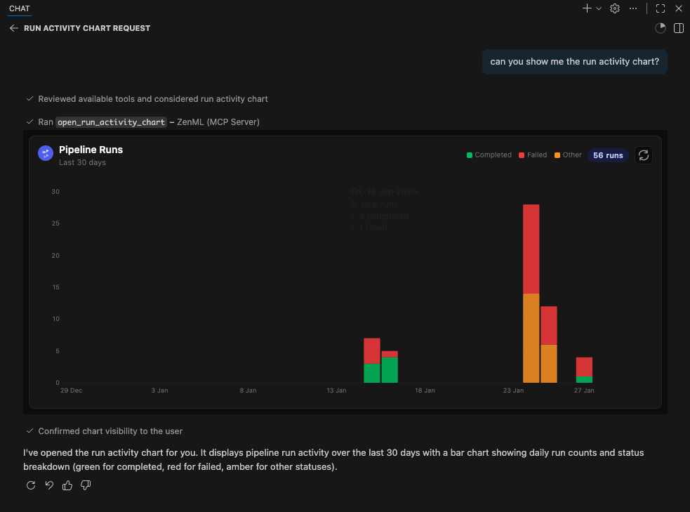
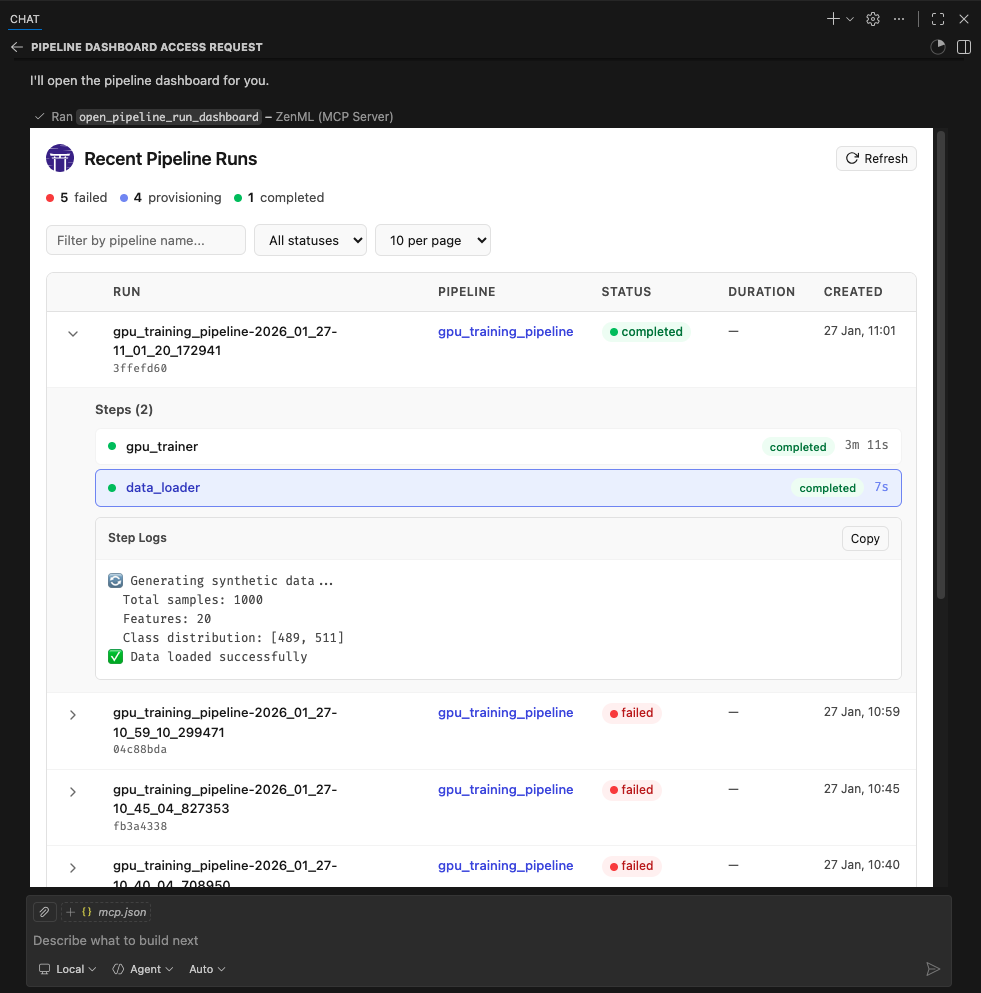

# MCP Server for ZenML
[](https://archestra.ai/mcp-catalog/zenml-io__mcp-zenml)

This project implements a [Model Context Protocol
(MCP)](https://modelcontextprotocol.io/introduction) server for interacting with
the [ZenML](https://zenml.io) API.



## What is MCP?

The Model Context Protocol (MCP) is an open protocol that standardizes how
applications provide context to Large Language Models (LLMs). It acts like a
"USB-C port for AI applications" - providing a standardized way to connect AI
models to different data sources and tools.

MCP follows a client-server architecture where:
- **MCP Hosts**: Programs like Claude Desktop or IDEs that want to access data through MCP
- **MCP Clients**: Protocol clients that maintain 1:1 connections with servers
- **MCP Servers**: Lightweight programs that expose specific capabilities through the standardized protocol
- **Local Data Sources**: Your computer's files, databases, and services that MCP servers can securely access
- **Remote Services**: External systems available over the internet that MCP servers can connect to

## What is ZenML?

ZenML is an open-source platform for building and managing ML and AI pipelines.
It provides a unified interface for managing data, models, and experiments.

For more information, see the [ZenML website](https://zenml.io) and [our documentation](https://docs.zenml.io).

## Features

The server provides MCP tools to access core read functionality from the ZenML
server, providing a way to get live information about:

### Core Entities
- **Users** - user accounts and permissions
- **Stacks** - infrastructure configurations
- **Stack Components** - individual stack building blocks
- **Flavors** - available component types
- **Service Connectors** - cloud authentication

### Pipeline Execution
- **Pipelines** - pipeline definitions
- **Pipeline Runs** - execution history and status
- **Pipeline Steps** - individual step details, code, and logs
- **Schedules** - automated run schedules
- **Artifacts** - metadata about data artifacts (not the data itself)

### Deployment & Serving
- **Snapshots** - frozen pipeline configurations (the "what to run/serve" artifact)
- **Deployments** - runtime serving instances with status, URL, and logs
- **Services** - model serving endpoints

### Organization & Discovery
- **Projects** - organizational containers for ZenML resources
- **Tags** - cross-cutting metadata labels for discovery
- **Builds** - pipeline build artifacts with image and code info

### Models
- **Models** - ML model registry entries
- **Model Versions** - versioned model artifacts

### Compatibility APIs (migration recommended)
- **Pipeline run templates** remain available in ZenML 0.96.4, while **Snapshots** are preferred for new workflows (see [Migration Guide](#migration-run-templates--snapshots))

The server also allows you to **trigger new pipeline runs** using snapshots (preferred) or the deprecated template-based trigger parameter.

*Note: We're continuously improving this integration based on user feedback.
Please join our [Slack community](https://zenml.io/slack) to share your experience
and help us make it even better!*

## Tool profiles and write policy

The default `compact` profile advertises 16 tools. Seven generic tools cover the
resource catalog, reads, ordinary mutations, and finite lifecycle actions:

| Tool | Purpose |
|------|---------|
| `zenml_describe_resources` | Discover supported resource types and bounded operation schemas |
| `zenml_list_resources` | List one resource type with validated filters and pagination |
| `zenml_get_resource` | Get one resource, with parent and project scope where required |
| `zenml_create_resource` | Create a supported resource from a typed payload |
| `zenml_update_resource` | Update one exact resource UUID |
| `zenml_delete_resource` | Delete or archive one exact resource UUID |
| `zenml_action_resource` | Run an allowlisted lifecycle or relation action without retries |

Nine focused tools remain because they provide diagnostics, active context,
streamed logs or code, pipeline execution, or an interactive App:

- `diagnose_zenml_setup`
- `get_active_user` and `get_active_project`
- `trigger_pipeline`
- `get_step_logs`, `get_step_code`, and `get_deployment_logs`
- `open_pipeline_run_dashboard` and `open_run_activity_chart`

Use `ZENML_MCP_PROFILE=legacy` when an existing client still depends on the old
entity-specific names such as `list_pipeline_runs`. This retains the
characterized tool-name and schema compatibility layer for ZenML 0.96.4. It
does not add support for older ZenML server versions. Use it only while
migrating: legacy response shapes may expose more operational metadata than the
compact tools, although the server omits credential-bearing configuration and
other sensitive fields from both profiles.

Registration and write access are independent:

| Profile | Policy | Advertised tools |
|---------|--------|-----------------:|
| `compact` | `read_write` | 16 |
| `compact` | `read_only` | 11 |
| `legacy` | `read_write` | 57 |
| `legacy` | `read_only` | 52 |

Set `ZENML_MCP_WRITE_POLICY=read_only` to remove all four generic mutation tools
and `trigger_pipeline` from MCP discovery and dispatch. Resource discovery also
omits create, update, delete, and action schemas. The older
`ZENML_MCP_READ_ONLY=true` setting remains accepted; invalid policy values fail
closed to read-only mode. An invalid `ZENML_MCP_PROFILE` stops startup with a
configuration error.

Version 2.0.0 requires MCP Python SDK 2.2.0 and ZenML 0.96.4. The compact
profile is the new default and is a breaking discovery change for clients that
call entity-specific tool names. Set `ZENML_MCP_PROFILE=legacy` while migrating
those clients, then move each call to the generic resource tools.

Mutation results distinguish `completed`, `accepted`, and `unknown` outcomes.
The server does not retry a mutation after it may have reached ZenML. For an
accepted or unknown result, follow the reconciliation instructions in the
response before deciding whether to call again. Use the named read when one is
available. Webhook creation and secret rotation can return a new signing secret
once; later reads omit it. Delete schemas state
whether an operation archives metadata, removes metadata, deprovisions a live
resource, or can delete stored artifact data.

The first 2.0 release covers ordinary operations for projects, stacks and
components, flavors, services, pipelines and runs, snapshots and templates,
deployments, artifacts and versions, models and versions, tags, connectors,
code repositories, webhooks, triggers, wait conditions, and hook invocations.
Users, schedules, service connector types, secrets, and resource requests have
the read-only coverage shown by `zenml_describe_resources`. It excludes ZenML
Cloud control-plane administration, Resource Manager administration, user and
credential administration, secret-value CRUD, connector login and verification,
raw webhook events, and aggregate debugging or lineage tools.

Start a generic workflow by discovering the precise schema, then calling it:

```text
zenml_describe_resources(resource_type="pipeline_run", operation="list")
zenml_list_resources(
    resource_type="pipeline_run",
    filters={"status": "completed", "sort_by": "desc:created"},
    page=1,
    size=10,
)
```

Prompts and resources remain available in both profiles. The analysis prompts,
the bounded resource-schema endpoints, and `most_recent_runs` are MCP prompts or
resources rather than tools.

### Run-template compatibility

ZenML 0.96.4 retains run-template CRUD APIs. Snapshots are preferred for new
workflows. Pipeline convenience creation and the template-based trigger
parameter are deprecated. In the legacy profile, `get_run_template` and
`list_run_templates` remain available for existing clients.

The legacy `tag` input remains in `list_run_templates` for schema compatibility,
but ZenML 0.96.4 has no equivalent server-side filter. A non-null value is
rejected before the SDK call. Snapshot tag filtering remains available.

## Migration: Run Templates → Snapshots

**Why the change?** Snapshots replaced run templates as ZenML's preferred
runnable pipeline artifact. The 0.96.4 SDK still supports run-template CRUD,
while new code should use snapshots.

### Quick Migration Guide

| Legacy Pattern (Templates) | Compact Pattern (Snapshots) |
|----------------------------|-----------------------------|
| `list_run_templates()` | `zenml_list_resources(resource_type="snapshot", filters={"runnable": true, "named_only": true})` |
| `get_run_template(name)` | `zenml_get_resource(resource_type="snapshot", resource_id=id)` |
| `trigger_pipeline(template_id=...)` | `trigger_pipeline(snapshot_name_or_id=...)` |

### Example Workflow (Snapshot-First)

```
1. Discover project context:
   → get_active_project()

2. Find runnable snapshots:
   → zenml_list_resources(resource_type="snapshot", filters={"runnable": true, "named_only": true})

3. Trigger a run:
   → trigger_pipeline(snapshot_name_or_id="my-snapshot")

4. Check deployments:
   → zenml_list_resources(resource_type="deployment", filters={"status": "running"})
   → get_deployment_logs(name_id_or_prefix="my-deployment", tail=100)
```

**Note:** `get_deployment_logs` returns bounded output (default 100 lines, max 1000, capped at 100KB) and requires the appropriate deployer integration to be installed.

## Quick Setup via Dashboard (Recommended)

The easiest way to set up the ZenML MCP Server is through your ZenML dashboard's **MCP Settings page**.



Navigate to **Settings → MCP** in your ZenML dashboard to get:

- **Pre-configured snippets** for your specific server URL and credentials
- **One-click installation** via deep links for supported IDEs
- **Copy-paste configurations** for VS Code, Claude Desktop, Cursor, Claude Code, OpenAI Codex, and more
- **Docker and uv options** based on your preference

### ZenML Pro Users

The MCP Settings page lets you generate a Personal Access Token (PAT) with a single click. The token is automatically included in all generated configuration snippets.

### ZenML OSS Users

1. First create a service account token via **Settings → Service Accounts**
2. Paste the token into the MCP Settings page
3. Copy the generated configuration for your IDE

---

**Prefer manual setup?** See the detailed instructions below.

## MCP Apps (Experimental)

> **What are MCP Apps?** MCP Apps are interactive HTML UIs that MCP servers can
> serve directly into AI clients. They render in sandboxed iframes and can call
> server tools bidirectionally. See the [official announcement](https://blog.modelcontextprotocol.io/posts/2026-01-26-mcp-apps/)
> for full details.



This server includes two experimental MCP Apps:

| App | Tool | Description |
|-----|------|-------------|
| **Pipeline Runs Dashboard** | `open_pipeline_run_dashboard` | Interactive table of recent pipeline runs with status, step details, and logs |
| **Run Activity Chart** | `open_run_activity_chart` | Bar chart of pipeline run activity over the last 30 days with status breakdown |



These apps are included as proof-of-concept examples. We welcome feedback and contributions for more MCP Apps. It is still early days for this new feature so we'll have to see how it evolves. We expect to support it more fully in the future.

### Supported Clients

MCP Apps require **Streamable HTTP** transport (not stdio). The following clients
currently support MCP Apps:

- ✅ **VS Code** (Insiders Edition)
- ✅ **Goose**
- ✅ **ChatGPT** (launching soon)
- ⚠️ **Claude Desktop** -- as of late January 2026, doesn't yet render Apps.
- ⚠️ **Claude.ai** (web) — as of late January 2026, doesn't yet render Apps.

> **Note:** We were unable to test thoroughly with Claude Desktop or Claude.ai at the time of writing. If you encounter issues, please [report them](https://github.com/zenml-io/mcp-zenml/issues).

### Running MCP Apps with Docker

MCP Apps use Streamable HTTP. Keep the container port bound to loopback and put
an authenticated reverse proxy or identity-aware access service in front of it
before allowing remote access. Host and Origin validation protect against DNS
rebinding; they do not authenticate callers.

**1. Build and run the Docker container:**

```bash
docker build -t mcp-zenml:apps .

docker run --rm -d --name mcp-zenml-apps -p 127.0.0.1:8001:8001 \
  -e ZENML_STORE_URL="https://your-zenml-server.example.com" \
  -e ZENML_STORE_API_KEY="your-api-key" \
  -e ZENML_MCP_PROFILE="compact" \
  -e ZENML_MCP_WRITE_POLICY="read_write" \
  -e ZENML_ACTIVE_PROJECT_ID="your-project-id" \
  mcp-zenml:apps --transport streamable-http --host 0.0.0.0 --port 8001 \
  --disable-dns-rebinding-protection
```

**2. Configure authenticated remote access:**

Create a named Cloudflare Tunnel, Tailscale Funnel with access controls, or an
equivalent authenticated reverse proxy. Point its private origin at
`http://127.0.0.1:8001`, require an identity or service credential for the
public hostname, and pass only authenticated requests to the origin. Configure
your MCP client to use the provider's supported OAuth flow or authorization
headers.

Before adding ZenML credentials to the container, verify that an unauthenticated
request cannot reach MCP:

```bash
curl -i https://mcp.example.com/mcp
```

The response must be the access provider's `401`, `403`, or login redirect. A
JSON-RPC or MCP response means the perimeter is open and must be fixed first.

**3. Connect your authenticated client:**

```json
{
	"servers": {
		"ZenML": {
			"url": "https://mcp.example.com/mcp",
			"type": "http"
		}
	},
	"inputs": []
}
```

- Ask the AI to "open the pipeline runs dashboard" or "show the run activity chart"

**Important notes:**
- `ZENML_ACTIVE_PROJECT_ID` is required — without it, pipeline run tools will
  fail with "No project is currently set as active"
- `--disable-dns-rebinding-protection` is only appropriate when the authenticated
  proxy validates the public host and the container port remains loopback-only
- Restrict the ZenML API key to the permissions the MCP client needs; use
  `ZENML_MCP_WRITE_POLICY=read_only` for inspection-only clients

## Testing & Quality Assurance

This project includes automated testing to ensure the MCP server remains functional:

- **🔄 Automated Smoke Tests**: A comprehensive smoke test runs every 3 days via GitHub Actions
- **🚨 Issue Creation**: Failed tests automatically create GitHub issues with detailed debugging information
- **⚡ Fast CI**: Uses UV with caching for quick dependency installation and testing
- **🧪 Manual Testing**: You can run the smoke test locally using `uv run scripts/test_mcp_server.py server/zenml_server.py`

The automated tests verify:
- MCP protocol connection and handshake
- Server initialization and tool discovery
- Basic tool functionality (when ZenML server is accessible)
- Resource and prompt enumeration
- `diagnose_zenml_setup` returns structured diagnostics even in constrained environments

Credential-free CI covers every adapter through the MCP protocol. PR and
release CI also start a fresh ZenML 0.96.4 OSS server on a loopback address and
run persisted CRUD and same-name project-isolation receipts. The server uses a
temporary configuration and database that are removed when the job exits; no
repository environment, self-hosted runner, or ZenML credential is required.

ZenML's local OSS server disables authentication and its SQL store does not
support pipeline replay or external deployment infrastructure. Restricted
access and feature-enabled trigger, replay, deployment, wait-condition, and
resource-request receipts therefore remain separate opt-in gates. They require
`ZENML_MCP_RESTRICTED_INTEGRATION=1` with
`ZENML_MCP_RESTRICTED_API_KEY`, or `ZENML_MCP_ACTION_INTEGRATION=1` with the
exact disposable fixture UUIDs in `ZENML_MCP_ACTION_FIXTURE`, respectively. A
gated skip is not evidence that those capabilities passed. An operator can set
`ZENML_MCP_REQUIRE_COMPLETE_INTEGRATION=1` to turn a missing opt-in gate into a
failure. Cloud infrastructure provisioning is never part of the default test
run.

## Debugging with MCP Inspector

For interactive debugging, use the [MCP Inspector](https://modelcontextprotocol.io/docs/tools/inspector) — a web-based tool that lets you test MCP tools in real-time:

```bash
# Using .env.local (recommended for development)
cp .env.local.example .env.local  # Then edit with your credentials
source .env.local && npx @modelcontextprotocol/inspector \
  -e ZENML_STORE_URL=$ZENML_STORE_URL \
  -e ZENML_STORE_API_KEY=$ZENML_STORE_API_KEY \
  -- uv run server/zenml_server.py
```

This opens a web UI with your credentials pre-filled — just click **Connect** and use the **Tools** tab to test any tool interactively.

See [CLAUDE.md](CLAUDE.md#debugging-with-mcp-inspector) for more detailed debugging instructions.

## Privacy & Analytics

The ZenML MCP Server collects anonymous usage analytics to help us improve the product.

**We track:**
- Which tools are used and how often
- Error rates and types (error type only, no messages)
- Basic environment info (OS, Python version, and whether running in Docker/CI)
- Session duration and tool usage patterns

**We do NOT collect:**
- Your ZenML server URL or API key
- Pipeline names, model names, or any business data
- Error messages or stack traces
- Any personally identifiable information

**To disable analytics:**

```bash
# Option 1
export ZENML_MCP_ANALYTICS_ENABLED=false

# Option 2
export ZENML_MCP_DISABLE_ANALYTICS=true
```

**For debugging/testing (logs events to stderr instead of sending):**

```bash
export ZENML_MCP_ANALYTICS_DEV=true
```

**For Docker users:** You can set `ZENML_MCP_ANALYTICS_ID` (must be a valid UUID) to maintain a consistent anonymous ID across container restarts. If you don't set it and the container filesystem can't persist the analytics ID file, the server falls back to a deterministic anonymous UUID derived from a hash of `ZENML_STORE_URL` (the URL itself is never sent as an event property).

**Additional analytics options:**
- `ZENML_MCP_ANALYTICS_SHUTDOWN_TIMEOUT_S` — max time (seconds) to flush analytics synchronously during shutdown (default: 1.0)

**Note on shutdown tracking:** Shutdown events are sent synchronously with a bounded timeout for best delivery reliability. However, if a container is killed with `SIGKILL` (e.g., `docker kill`), shutdown handlers cannot fire — this is a Docker/OS limitation, not a bug.

### Startup Validation

You can enable a lightweight startup diagnostic check:

```bash
# Print warnings but start normally
uv run server/zenml_server.py --startup-validation warn

# Exit non-zero if required setup is missing (useful in Docker/CI)
uv run server/zenml_server.py --startup-validation strict
```

You can also set this via environment variable: `ZENML_MCP_STARTUP_VALIDATION=warn`.

The `diagnose_zenml_setup` tool is also available as an MCP tool for runtime troubleshooting — it works even when the ZenML SDK is not installed or environment variables are missing.

## Manual Setup

### Prerequisites

You will need to have access to a deployed ZenML server. If you don't have one,
you can sign up for a free trial at [ZenML Pro](https://cloud.zenml.io) and we'll manage the deployment for you.

> **Tip:** Once you have a ZenML server, check out the [MCP Settings page](#quick-setup-via-dashboard-recommended) in your dashboard for the easiest setup experience.

> **Compatibility:** Version 2.0.0 is tested against **ZenML 0.96.4**.
> If you are running an older ZenML version, please use an [earlier release](https://github.com/zenml-io/mcp-zenml/releases) of this MCP server.

You will also (probably) need to have `uv` installed locally. For more information, see
the [`uv` documentation](https://docs.astral.sh/uv/getting-started/installation/).
We recommend installation via their installer script or via `brew` if using a
Mac. (Technically you don't *need* it, but it makes installation and setup easy.)

You will also need to clone this repository somewhere locally:

```bash
git clone https://github.com/zenml-io/mcp-zenml.git
```

### Your MCP config file

The MCP config file is a JSON file that tells the MCP client how to connect to
your MCP server. Different MCP clients will use or specify this differently. Two
commonly-used MCP clients are [Claude Desktop](https://claude.ai/download) and
[Cursor](https://www.cursor.com/), for which we provide installation instructions
below.

You will need to specify your ZenML MCP server in the following format:

```json
{
    "mcpServers": {
        "zenml": {
            "command": "/usr/local/bin/uv",
            "args": ["run", "path/to/server/zenml_server.py"],
            "env": {
                "LOGLEVEL": "WARNING",
                "NO_COLOR": "1",
                "ZENML_LOGGING_COLORS_DISABLED": "true",
                "ZENML_LOGGING_VERBOSITY": "WARN",
                "ZENML_ENABLE_RICH_TRACEBACK": "false",
                "ZENML_MCP_PROFILE": "compact",
                "ZENML_MCP_WRITE_POLICY": "read_write",
                "PYTHONUNBUFFERED": "1",
                "PYTHONIOENCODING": "UTF-8",
                "ZENML_STORE_URL": "https://your-zenml-server-goes-here.com",
                "ZENML_STORE_API_KEY": "your-api-key-here"
            }
        }
    }
}
```

There are four dummy values that you will need to replace:

- the path to your locally installed `uv` (the path listed above is where it
  would be on a Mac if you installed it via `brew`)
- the path to the `zenml_server.py` file (this is the file that will be run when
  you connect to the MCP server). This file is located inside this repository at
  the root. You will need to specify the exact full path to this file.
- the ZenML server URL (this is the URL of your ZenML server. You can find this
  in the ZenML Cloud UI). It will look something like `https://d534d987a-zenml.cloudinfra.zenml.io`.
- the ZenML server API key (this is the API key for your ZenML server. You can
  find this in the ZenML Cloud UI or [read these
  docs](https://docs.zenml.io/how-to/manage-zenml-server/connecting-to-zenml/connect-with-a-service-account)
  on how to create one. For the purposes of the ZenML MCP server we recommend
  using a service account.)

You are free to change the way you run the MCP server Python file, but using
`uv` will probably be the easiest option since it handles the environment and
dependency installation for you.


### Installation for use with Claude Desktop

> **Quick alternative:** Use the MCP Settings page in your ZenML dashboard (Settings → MCP) to get pre-configured installation instructions and deep links for Claude Desktop.

You will need to have the latest version of [Claude Desktop](https://claude.ai/download) installed.

You can simply open the Settings menu and drag the `mcp-zenml.mcpb` file from the
root of this repository onto the menu and it will guide you through the
installation and setup process. You'll need to add your ZenML server URL and API key.

Note: MCP bundles (`.mcpb`) replace the older Desktop Extensions (`.dxt`) format; existing `.dxt` files still work in Claude Desktop.

#### Optional: Improving ZenML Tool Output Display

For a better experience with ZenML tool results, you can configure Claude to
display the JSON responses in a more readable format. In Claude Desktop, go to
Settings → Profile, and in the "What personal preferences should Claude consider
in responses?" section, add something like the following (or use these exact
words!):

```markdown
When using zenml tools which return JSON strings and you're asked a question, you might want to consider using markdown tables to summarize the results or make them easier to view!
```

This will encourage Claude to format ZenML tool outputs as markdown tables,
making the information much easier to read and understand.

### Installation for use with Cursor

> **Quick alternative:** The MCP Settings page in your ZenML dashboard (Settings → MCP) can generate the exact `mcp.json` content with your credentials pre-filled.

You will need to have [Cursor](https://www.cursor.com/) installed.

Cursor works slightly differently to Claude Desktop in that you specify the
config file on a per-repository basis. This means that if you want to use the
ZenML MCP server in multiple repos, you will need to specify the config file in
each of them.

To set it up for a single repository, you will need to:

- create a `.cursor` folder in the root of your repository
- inside it, create a `mcp.json` file with the content above
- go into your Cursor settings and click on the ZenML server to 'enable' it.

In our experience, sometimes it shows a red error indicator even though it is
working. You can try it out by chatting in the Cursor chat window. It will let
you know if is able to access the ZenML tools or not.

## Docker Image

You can run the server as a Docker container. The process communicates over stdio, so it will wait for an MCP client connection. Pass your ZenML credentials via environment variables.

### Prebuilt Images (Docker Hub)

Pull the latest multi-arch image:

```bash
docker pull zenmldocker/mcp-zenml:latest
```

Versioned releases are tagged as `X.Y.Z`:

```bash
docker pull zenmldocker/mcp-zenml:2.0.0
```

Run with your ZenML credentials (stdio mode):

```bash
docker run -i --rm \
  -e ZENML_STORE_URL="https://your-zenml-server.example.com" \
  -e ZENML_STORE_API_KEY="your-api-key" \
  zenmldocker/mcp-zenml:latest
```

### Canonical MCP config using Docker

```json
{
  "mcpServers": {
    "zenml": {
      "command": "docker",
      "args": [
        "run", "-i", "--rm",
        "-e", "ZENML_STORE_URL=https://...",
        "-e", "ZENML_STORE_API_KEY=ZENKEY_...",
        "-e", "ZENML_ACTIVE_PROJECT_ID=...",
        "-e", "ZENML_MCP_PROFILE=compact",
        "-e", "ZENML_MCP_WRITE_POLICY=read_write",
        "-e", "LOGLEVEL=WARNING",
        "-e", "NO_COLOR=1",
        "-e", "ZENML_LOGGING_COLORS_DISABLED=true",
        "-e", "ZENML_LOGGING_VERBOSITY=WARN",
        "-e", "ZENML_ENABLE_RICH_TRACEBACK=false",
        "-e", "PYTHONUNBUFFERED=1",
        "-e", "PYTHONIOENCODING=UTF-8",
        "zenmldocker/mcp-zenml:latest"
      ]
    }
  }
}
```

### Build Locally

From the repository root:

```bash
docker build -t zenmldocker/mcp-zenml:local .
```

Run the locally built image:

```bash
docker run -i --rm \
  -e ZENML_STORE_URL="https://your-zenml-server.example.com" \
  -e ZENML_STORE_API_KEY="your-api-key" \
  zenmldocker/mcp-zenml:local
```

## MCP Bundles (.mcpb)

This project uses MCP Bundles (`.mcpb`) — the successor to Anthropic's Desktop Extensions (DXT). MCP Bundles package an entire MCP server (including dependencies) into a single file with user-friendly configuration.

Note on rename: MCP Bundles replace the older `.dxt` format. Claude Desktop remains backward‑compatible with existing `.dxt` files, but we now ship `mcp-zenml.mcpb` and recommend using it going forward.

The `mcp-zenml.mcpb` file in the repository root uses the MCPB 0.4 UV runtime.
The host installs the pinned Python dependencies for the current operating
system, so the same bundle works on macOS, Windows, and Linux without embedding
platform-specific native extensions. Installation needs network access the
first time UV resolves the bundled environment.

Bundle builds reuse the committed `mcpb-uv.lock` and resolve its Python
dependency graph in offline mode. Set `MCPB_REFRESH_LOCK=1` only when
intentionally refreshing those pins.

When you drag and drop the `.mcpb` file into Claude Desktop's settings, it automatically handles:
- Runtime dependency installation
- Secure configuration management  
- Cross-platform compatibility
- User-friendly setup process

For more information, see Anthropic's announcement of Desktop Extensions (DXT) and related MCP bundle packaging guidance in their documentation: https://www.anthropic.com/engineering/desktop-extensions

## Published on the Anthropic MCP Registry

This MCP server is published to the official Anthropic MCP Registry and is discoverable by compatible hosts. On each **tagged release**, our CI updates the registry entry via the registry’s `mcp-publisher` CLI using GitHub OIDC, so you can install or discover the **ZenML MCP Server** directly wherever the registry is supported (e.g., Claude Desktop’s Extensions catalog).

- **Always up to date:** the registry entry is refreshed with every release from the tagged commit’s `manifest.json` and `server.json`.
- **Alternate install paths:** you can still install locally via the packaged `.mcpb` bundle (see above) or run the Docker image.

Learn more about the registry here:
- Anthropic MCP Registry (community repo): https://github.com/modelcontextprotocol/registry
