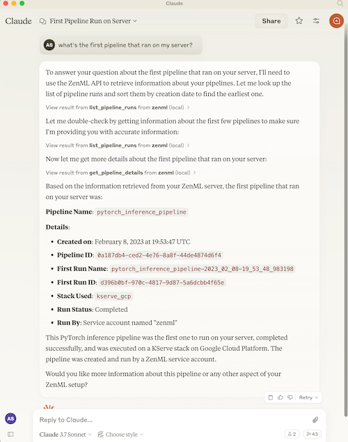

# MCP Server for ZenML

This project implements a [Model Context Protocol
(MCP)](https://modelcontextprotocol.io/introduction) server for interacting with
the [ZenML](https://zenml.io) API.



## What is MCP?

The Model Context Protocol (MCP) is an open protocol that standardizes how
applications provide context to Large Language Models (LLMs). It acts like a
"USB-C port for AI applications" - providing a standardized way to connect AI
models to different data sources and tools.

MCP follows a client-server architecture where:
- **MCP Hosts**: Programs like Claude Desktop or IDEs that want to access data through MCP
- **MCP Clients**: Protocol clients that maintain 1:1 connections with servers
- **MCP Servers**: Lightweight programs that expose specific capabilities through the standardized protocol
- **Local Data Sources**: Your computer's files, databases, and services that MCP servers can securely access
- **Remote Services**: External systems available over the internet that MCP servers can connect to

## What is ZenML?

ZenML is an open-source platform for building and managing ML and AI pipelines.
It provides a unified interface for managing data, models, and experiments.

For more information, see the [ZenML website](https://zenml.io) and [our documentation](https://docs.zenml.io).

## Features

The server provides MCP tools to access core read functionality from the ZenML
server, providing a way to get live information about:

- Users
- Stacks
- Pipelines
- Pipeline runs
- Pipeline steps
- Services
- Stack components
- Flavors
- Pipeline run templates
- Schedules
- Artifacts (metadata about data artifacts, not the data itself)
- Service Connectors
- Step code
- Step logs (if the step was run on a cloud-based stack)

It also allows you to trigger new pipeline runs (if a run template is present).

*Note: This is a beta/experimental release. We're still exploring how people
will use this integration, so we welcome your feedback and suggestions! Please
join our [Slack community](https://zenml.io/slack) to share your experience and
help us improve.*

## Testing & Quality Assurance

This project includes automated testing to ensure the MCP server remains functional:

- **🔄 Automated Smoke Tests**: A comprehensive smoke test runs every 3 days via GitHub Actions
- **🚨 Issue Creation**: Failed tests automatically create GitHub issues with detailed debugging information
- **⚡ Fast CI**: Uses UV with caching for quick dependency installation and testing
- **🧪 Manual Testing**: You can run the smoke test locally using `uv run scripts/test_mcp_server.py server/zenml_server.py`

The automated tests verify:
- MCP protocol connection and handshake
- Server initialization and tool discovery  
- Basic tool functionality (when ZenML server is accessible)
- Resource and prompt enumeration

## How to use

### Prerequisites

You will need to have access to a deployed ZenML server. If you don't have one,
you can sign up for a free trial at [ZenML Pro](https://cloud.zenml.io) and we'll manage the deployment for you.

You will also (probably) need to have `uv` installed locally. For more information, see
the [`uv` documentation](https://docs.astral.sh/uv/getting-started/installation/).
We recommend installation via their installer script or via `brew` if using a
Mac. (Technically you don't *need* it, but it makes installation and setup easy.)

You will also need to clone this repository somewhere locally:

```bash
git clone https://github.com/zenml-io/mcp-zenml.git
```

### Your MCP config file

The MCP config file is a JSON file that tells the MCP client how to connect to
your MCP server. Different MCP clients will use or specify this differently. Two
commonly-used MCP clients are [Claude Desktop](https://claude.ai/download) and
[Cursor](https://www.cursor.com/), for which we provide installation instructions
below.

You will need to specify your ZenML MCP server in the following format:

```json
{
    "mcpServers": {
        "zenml": {
            "command": "/usr/local/bin/uv",
            "args": ["run", "path/to/server/zenml_server.py"],
            "env": {
                "LOGLEVEL": "INFO",
                "NO_COLOR": "1",
                "PYTHONUNBUFFERED": "1",
                "PYTHONIOENCODING": "UTF-8",
                "ZENML_STORE_URL": "https://your-zenml-server-goes-here.com",
                "ZENML_STORE_API_KEY": "your-api-key-here"
            }
        }
    }
}
```

There are four dummy values that you will need to replace:

- the path to your locally installed `uv` (the path listed above is where it
  would be on a Mac if you installed it via `brew`)
- the path to the `zenml_server.py` file (this is the file that will be run when
  you connect to the MCP server). This file is located inside this repository at
  the root. You will need to specify the exact full path to this file.
- the ZenML server URL (this is the URL of your ZenML server. You can find this
  in the ZenML Cloud UI). It will look something like `https://d534d987a-zenml.cloudinfra.zenml.io`.
- the ZenML server API key (this is the API key for your ZenML server. You can
  find this in the ZenML Cloud UI or [read these
  docs](https://docs.zenml.io/how-to/manage-zenml-server/connecting-to-zenml/connect-with-a-service-account)
  on how to create one. For the purposes of the ZenML MCP server we recommend
  using a service account.)

You are free to change the way you run the MCP server Python file, but using
`uv` will probably be the easiest option since it handles the environment and
dependency installation for you.


### Installation for use with Claude Desktop

You will need to have the latest version of [Claude Desktop](https://claude.ai/download) installed.

You can simply open the Settings menu and drag the `mcp-zenml.dxt` file from the
root of this repository on top of the menu and it will guide you through the
installation and setup process. You'll need to add your ZenML server URL and API key.

#### Optional: Improving ZenML Tool Output Display

For a better experience with ZenML tool results, you can configure Claude to
display the JSON responses in a more readable format. In Claude Desktop, go to
Settings → Profile, and in the "What personal preferences should Claude consider
in responses?" section, add something like the following (or use these exact
words!):

```markdown
When using zenml tools which return JSON strings and you're asked a question, you might want to consider using markdown tables to summarize the results or make them easier to view!
```

This will encourage Claude to format ZenML tool outputs as markdown tables,
making the information much easier to read and understand.

### Installation for use with Cursor

You will need to have [Cursor](https://www.cursor.com/) installed.

Cursor works slightly differently to Claude Desktop in that you specify the
config file on a per-repository basis. This means that if you want to use the
ZenML MCP server in multiple repos, you will need to specify the config file in
each of them.

To set it up for a single repository, you will need to:

- create a `.cursor` folder in the root of your repository
- inside it, create a `mcp.json` file with the content above
- go into your Cursor settings and click on the ZenML server to 'enable' it.

In our experience, sometimes it shows a red error indicator even though it is
working. You can try it out by chatting in the Cursor chat window. It will let
you know if is able to access the ZenML tools or not.

## Desktop Extensions (DXT) Support

This project supports [Anthropic's Desktop Extensions (DXT) standard](https://www.anthropic.com/engineering/desktop-extensions), which makes installing MCP servers as simple as clicking a button. DXT is a new packaging format that bundles entire MCP servers into a single `.dxt` file, including all dependencies and providing user-friendly configuration.

The `mcp-zenml.dxt` file in the repository root contains everything needed to run the ZenML MCP server, eliminating the need for complex manual installation steps. This makes powerful ZenML integrations accessible to users without requiring technical setup expertise.

When you drag and drop the `.dxt` file into Claude Desktop's settings, it automatically handles:
- Runtime dependency installation
- Secure configuration management  
- Cross-platform compatibility
- User-friendly setup process

For more information about Desktop Extensions and the DXT standard, visit the [official documentation](https://www.anthropic.com/engineering/desktop-extensions).
